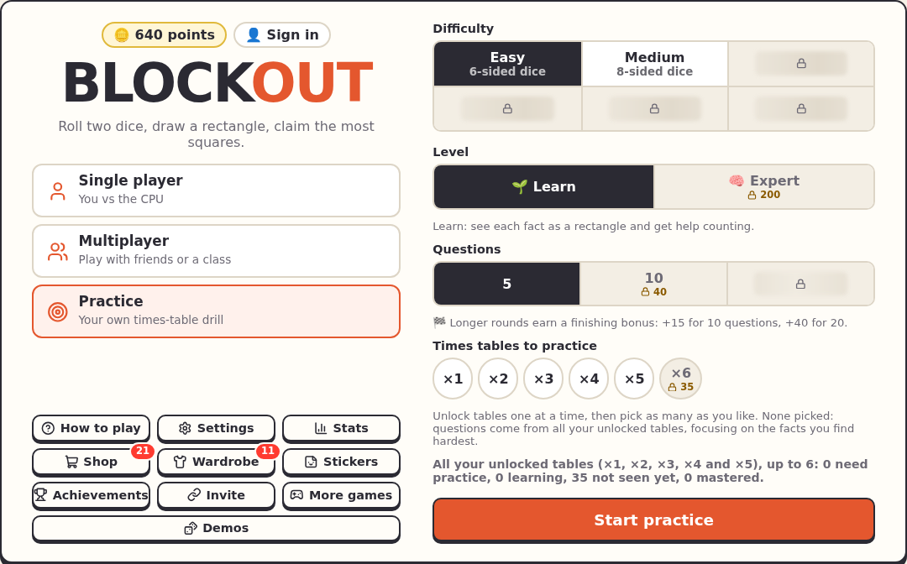
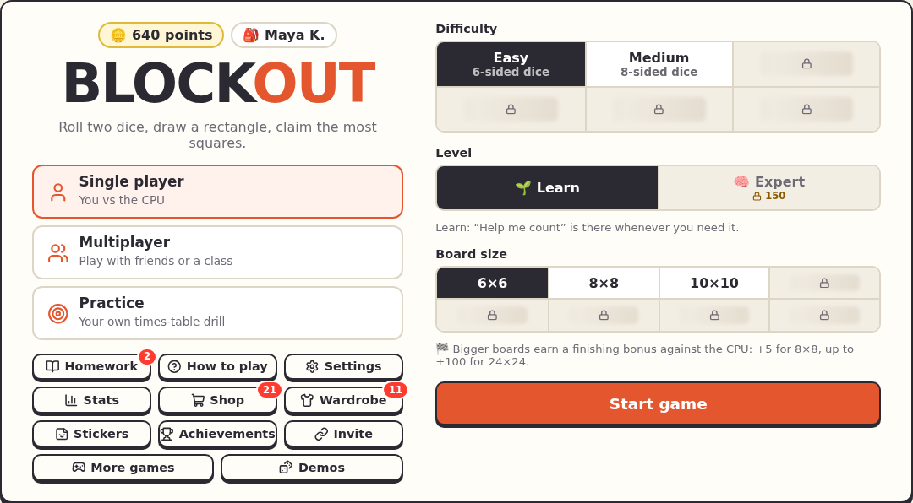
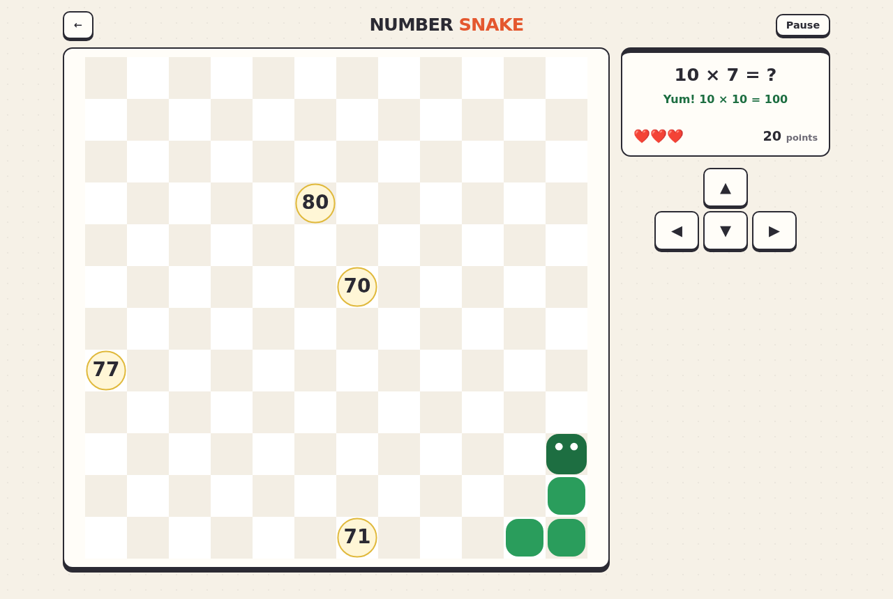
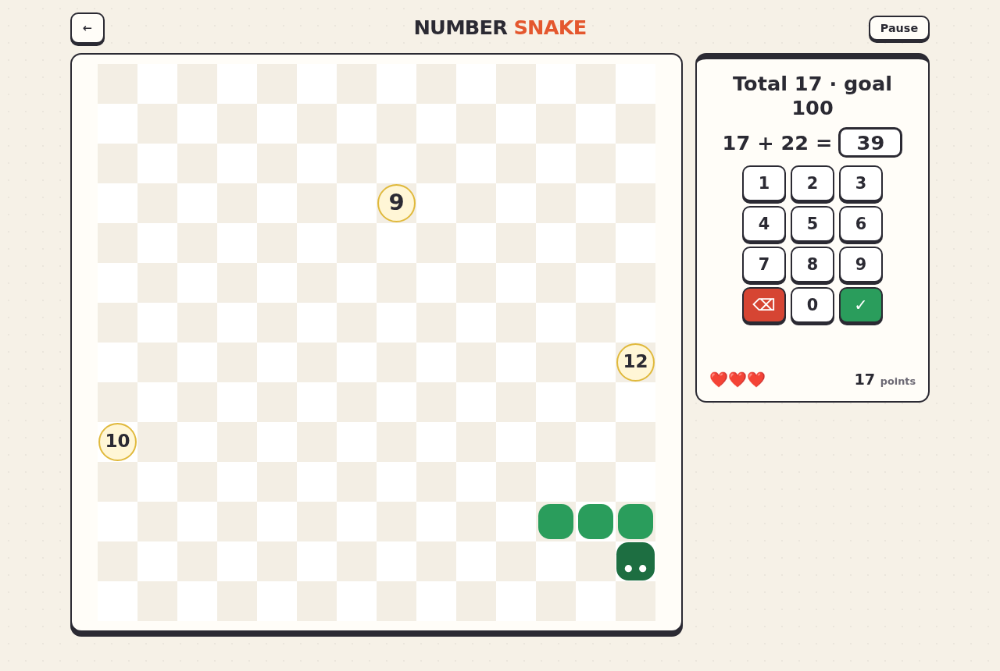
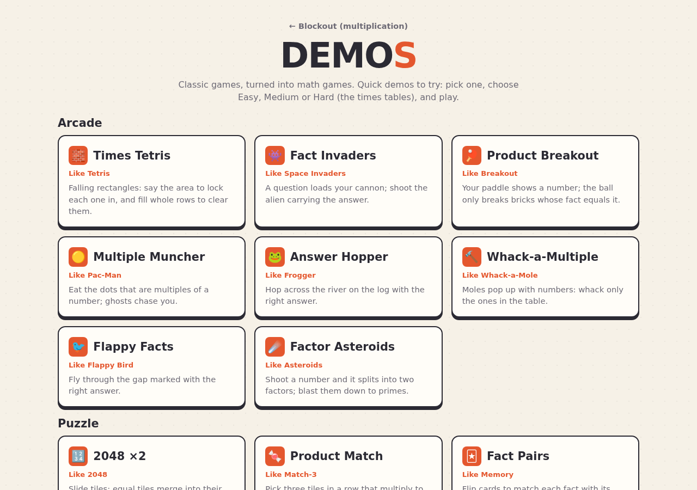
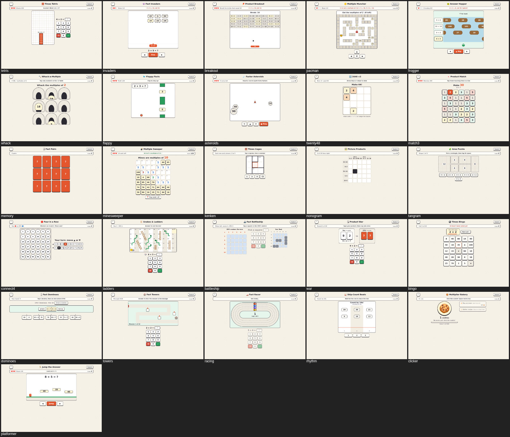

<title>Playing</title>

# Playing

Everything here works without an account. Progress is saved in the browser; [signing in](#accounts) keeps it with the student instead.

## Single player

Pick **Single player**, a difficulty and a board, and tap **Start game**. Roll, draw the rectangle (drag it out, or click to drop it once *Click to place* is unlocked), and answer. The CPU takes its turn and shows its working.

When the board is full, or nobody can place anything, the game ends. The results show the scores; **Show details** has the full stats, and the shop, Wardrobe and stickers are one tap away when there's something new.

## Practice

**Practice** asks questions without a board, picking the facts that need it most. **Learn** has help; **Expert** has none, doubles the bonus points and can add a timer. Longer rounds (10 or 20 questions) earn a finishing bonus.

## Difficulties

| Difficulty | The dice |
|---|---|
| Easy | Two 6-sided dice (free) |
| Medium | 8-sided dice |
| Hard | 12-sided dice |
| Tricky | Only the harder facts: 3, 4, 6, 7, 8, 9 and 12 |
| Master | The dice go after your weakest facts |
| Legend | Half the rolls are teens like 14 × 7 (split into 10 × 7 and 4 × 7), half Tricky facts; needs a 12×12 board or bigger |

Each difficulty unlocks when most of the Times Table below it is mastered.

## Points, shop and Wardrobe

Right answers earn points: more for first-try answers, streaks, quick answers on a timer, and finishing bigger boards. Points buy things in the **Shop**: new boards, difficulties, times tables for practice, and settings like auto roll. Unlocks come as a skill tree: only the next step shows its price.

The **Wardrobe** has looks: colours, dice, board themes, keypads and titles.

**Stats** shows every game and the Times Table: which facts are mastered, still being learned, or need practice.

## Home multiplayer

**Multiplayer → Home** is 2–4 players taking turns on one screen. (It's unlocked in the shop.)

## Accounts

Tap **👤 Sign in** at the top of the menu. A student's progress then follows them to any device, and the first time an account is used on a device, that device's guest progress is added to it. Signed-in students see **📚 Homework** on the menu; **Play ›** on a homework starts that game, set up and ready.

## More games

**More games** on the main menu leads to the same roll, place and answer game for other operations: addition, subtraction, division, and adding, subtracting, multiplying and dividing fractions. Each keeps its own maths explanations ("Show me how", and the CPU's working).

Each game has:

- **Single player**, **Home** (two players on one screen) and **Practice** (Learn, or Expert: a timer, no help and double points)
- **Points** for right answers (more for right first time and streaks), wins and finished practice rounds, in the game's own wallet
- **A shop** with its own unlock chains: Medium, then Hard; 20-question practice rounds, then Expert; Home multiplayer
- **Achievements** with the same banners as the main game, and **Stats** with every question coloured by how well it's known

## Number Snake

A snake game that eats numbers instead of apples (on More games). In **Answer it**, a question shows at the top (10 × 1 = ?): steer to the right answer and the snake grows; the other numbers are near misses. In **Multiples**, eat every multiple of a number to move on to the next table. In **Add it up**, every number is fair game: the one you eat is added to a running total, and the snake waits while you type the new total (or tap it on the keypad). Bigger numbers are harder sums and score more; reach the goal (30, 100 or 500) for a bonus, and the total starts again from 0. A wrong number costs one of three hearts and shows the right fact, and running into your own tail ends the game.

Two choices on the menu make it calmer or harder:

| Choice | Options |
|---|---|
| **Movement** | **Auto** (the default): the snake keeps going and the arrows steer it. **Manual**: it only moves when you press, one square per press, with no time pressure (Speed doesn't apply). |
| **Speed** | 🐌 Slow (the default), 🐢 Normal, 🐇 Fast. It speeds up a little with every right answer, but never past a limit for each speed. |
| **Walls** | **Stop** (the default): bump into the wall and wait for a turn, no harm done. **Wrap**: come back in on the other side. **Lose a heart**: stop, and lose a heart. **Game over**: the classic rule. |

Unless the walls wrap, numbers never appear along the edges, so you're never lured into a wall.

Steer with the arrow keys (or WASD), a swipe on the board, or the arrows beside it; Space pauses. Easy is ×2, ×5 and ×10; Medium ×1 to ×6; Hard ×1 to ×12, on bigger boards. In Add it up the numbers are 1–9, 5–25 or 11–99. Your best score is kept for each way to play.

## Demos

**Demos** on the main menu opens 26 quick demos: classic games turned into math games, to try out ideas. Each has Easy, Medium and Hard (the times tables), a score, and a message with the right fact after every mistake.

| Group | Demos |
|---|---|
| Arcade | Times Tetris, Fact Invaders, Product Breakout, Multiple Muncher (Pac-Man), Answer Hopper (Frogger), Whack-a-Multiple, Flappy Facts, Factor Asteroids |
| Puzzle | 2048 ×2, Product Match (Match-3), Fact Pairs (Memory), Multiple Sweeper (Minesweeper), Times Cages (KenKen), Picture Products (Nonogram), Area Puzzle (Tangram) |
| Board & card | Four in a Row, Snakes & Ladders, Fact Battleship, Product War, Times Bingo, Fact Dominoes |
| Other genres | Fact Towers (tower defense), Fact Racer, Skip-Count Beats (rhythm), Multiplier Bakery (idle clicker), Jump the Answer (platformer) |

## Cheat codes

Press ++grave++ (the key left of 1) for the cheat code box. Codes are secret; each one found earns a hidden achievement, and the box lists the active ones so they can be switched off. Cheats never work in class games.
